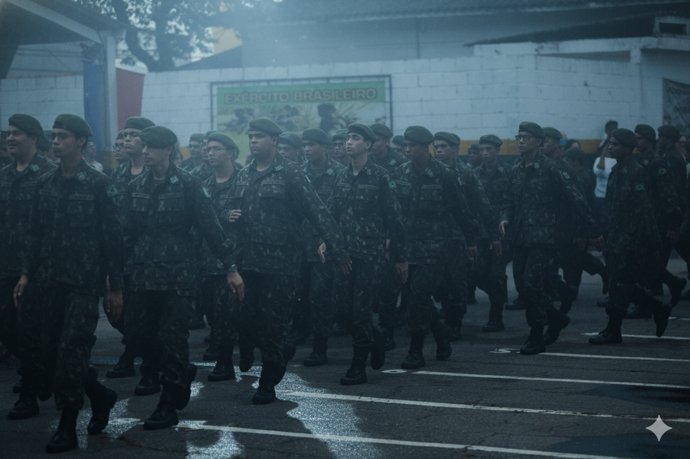

# TG02037-GAME



<br>
<br>

## **About the project**
A first-person horror game set during a night on duty at a military installation.

<br>
<br>

# Configuration

### Default keyboard configuration
| Keys | Action |
| - | - |
| W | Move Forward |
| A | Move Left |
| S | Move Backward |
| D | Move Right |
| C | Play "Cessa" |

> [!NOTE]
> Camera movements on the mouse

<br>
<br>

## **Resources**

To ensure a more functional and efficient game, the project is being developed using the following technologies:

- **[Visual Studio Code](https://code.visualstudio.com/)**: Editor de código leve e versátil, com suporte a extensões e múltiplas linguagens.
- **[GitHub](https://github.com/)**: Plataforma online para hospedagem e colaboração em projetos de código, usando controle de versão com Git.
- **[Godot Engine](https://godotengine.org/pt-br/)**: Free and open source community-driven 2D and 3D game engine! 

<br>
<br>

## 🛠️ Instalation

To access the game, follow the steps:

1. **Clone the repository**
   ```bash
   git clone https://github.com/CauaCurisno1446/TG02037-GAME.git
   cd TG02037-GAME
   ```

2. **Execute the game**
   ```bash
   launch.exe
   ```

